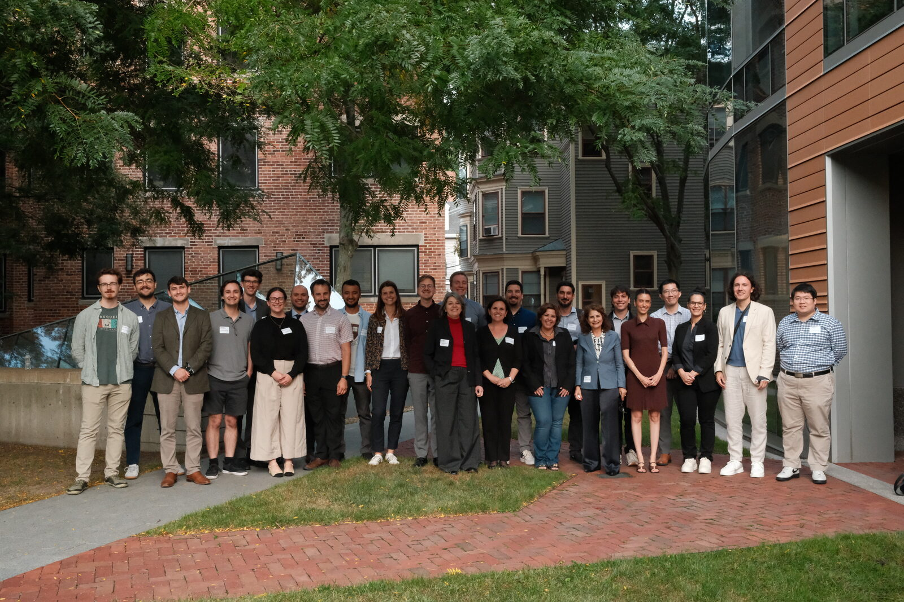

Our first conference was held on **Wednesday, September 2, 2026**, at Harvard University
as a pre-conference to APSA 2026: a full day of panels in William James Hall followed by a poster session in
CGIS Knafel. Thank you to everyone who presented, discussed, and attended.

{fig-alt="Group photo of about 25 conference participants standing outdoors on a brick path in front of trees and campus buildings."}

## Poster awards

The poster session featured a wide array of topics and methods, and every poster was
phenomenal. Two received poster awards:

::: {.award-list}
- 🏆 **[Mert Bayraktar](https://www.linkedin.com/in/mertbayraktar/)** — *Striking Back: Commodity Shocks and Anti-Union Violence in Colombia*
- 🏆 **[Murat Akdogan](https://www.muratakdogan.com/)** — *When Democracy Still Constrains: The Microfoundations of Democratic Accountability Under Party-Democracy Conflict*
:::

Congratulations to both!

## Program

- **[Schedule](schedule.qmd)** 
- **[Panels](panels.qmd)** 
- **[Posters](posters.qmd)** 

## Sponsors

The 2026 conference was supported by the [Center for American Political Studies (CAPS)](https://caps.gov.harvard.edu/) and the [Weatherhead Center for International Affairs](https://www.wcfia.harvard.edu/) at Harvard University.
